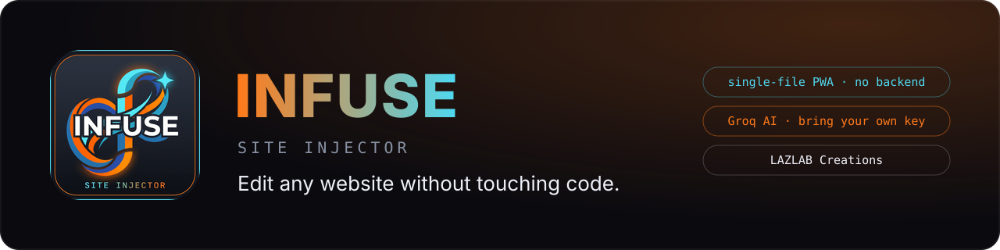
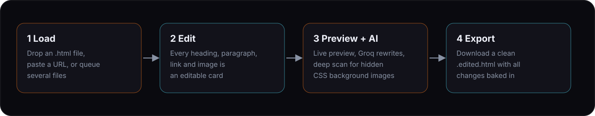
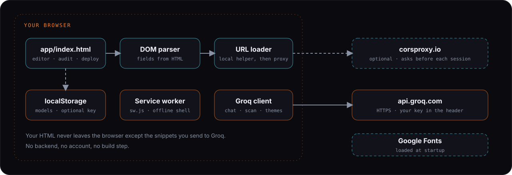

<p align="center">
  
</p>

# INFUSE Site Injector

Load any HTML file, rewrite every word, swap every image, regenerate the theme with AI, and export a clean standalone file. No FTP, no Git, no code editor.

INFUSE is a single-file Progressive Web App. It runs entirely in your browser. The only AI provider is [Groq](https://console.groq.com), using your own free key.

## Live URLs

| | |
|---|---|
| Landing page | https://johnlaz.github.io/infuse/ |
| App | https://johnlaz.github.io/infuse/app/ |

Open the app URL in Chrome, Edge or Safari and use **Install** or **Add to Home Screen** to run it like a native app. It works offline after the first load.

## How it works

<p align="center">
  
</p>

1. **Load** a `.html` file by drag and drop, queue several files, or inject one from a URL.
2. **Edit** the cards. Headings, paragraphs, links, buttons, list items, labels, table cells and images each get one. Upload replacement images (embedded as base64), edit alt text, filter by type, and search.
3. **Preview and AI.** Toggle a live preview and click anything in it to jump to its card. Ask Groq for rewrites, SEO and tone passes, or run **Deep Scan** to find images the parser misses (CSS `background-image`, `srcset`, `data-src`).
4. **Export** a clean `[name].edited.html`. Edits are applied by DOM path, not string replacement, so nested markup and repeated text export correctly.

### Modes

| Mode | What it does |
|---|---|
| **Edit** | The editor described above, plus themes and manual CSS-variable color overrides. |
| **Infuse** | Load two sites (A and B), scan both, and generate a merged "infused" file. |
| **Audit** | Migration audit: find old-domain and new-domain links, map pages, and generate redirect rules (`.htaccess`, nginx, or a plain list). |
| **Deploy** | Strip comments and minify HTML before deployment. Code logic is not touched. |

## Repo layout

```
/index.html           Landing page
/README.md            This file
/docs/                README visuals (SVG only)
/app/index.html       The entire app, self-contained
/app/manifest.json    PWA manifest (scope is relative, so the repo name can change)
/app/sw.js            Service worker
/app/icon-192.png
/app/icon-512.png
/app/shot-*.png       Install screenshots (2 phone, 2 desktop)
```

## AI and model setup

1. Get a free key at [console.groq.com/keys](https://console.groq.com/keys).
2. Click **Set Groq Key**, paste it, and press **Save & Activate**.
3. INFUSE fetches Groq's current model list and fills the two pickers in the same dialog:
   - **Fast model** for chat, per-field suggestions and rewrites. Default: `llama-3.1-8b-instant`.
   - **Deep model** for scans, bulk reviews and theme generation. Default: `llama-3.3-70b-versatile`.
4. Press **Refresh** any time to pull the latest list. Only chat-capable models are shown (speech, TTS and guard models are filtered out).

Your selections are never replaced automatically. If a model you picked disappears from Groq's list, it stays selected and is flagged, so you decide when to switch.

## Data and privacy

- **No backend.** Your HTML files are parsed and edited in the browser.
- **Groq.** When you use an AI feature, the text or HTML snippet involved is sent to `api.groq.com` with your key. Nothing else is sent there.
- **Your Groq key** lives in memory for the session. It is written to `localStorage` (unencrypted) only if you turn on **Remember Groq key** in Settings. Leave that off on shared devices.
- **Settings export** asks whether to include the key in the JSON file. If included, it is plain text.
- **Fetching a page by URL** tries an optional local helper on port 7842 first (not part of this repo). If it is not running, INFUSE asks before sending the URL through the third-party service `corsproxy.io`. Decline and nothing is sent.
- **Fonts** (Syne, Inter, JetBrains Mono) load from Google Fonts.
- `localStorage` keys used: `infuse_groq_key` (only if you opt in) and `infuse_models` (model choices and the cached list).

<p align="center">
  
</p>

## Deploy and update

Hosted on GitHub Pages from the `main` branch, root folder.

To ship a change:

1. Edit `app/index.html`.
2. Bump the version in **both** places so they stay in sync:
   - `APP_VER` near the top of the app script in `app/index.html`
   - `VERSION` at the top of `app/sw.js` (the cache name `infuse-v<VERSION>` is derived from it)
3. Update the version text in the landing page (`index.html`, two places) and add a changelog entry below.
4. Commit and push.

Installed copies pick up the new service worker and show an **Update ready** button. Tapping it reloads into the new version. The version badge in the app's top bar shows `APP_VER`, and hovering it warns if the service worker is on a different version.

Hard-coded repo names are not used. If you move the app, only the live URLs in this README and the `og:image` URL in `index.html` need updating.

## Changelog

### 5.1.0
- New app icon, filled to the corners (192 and 512 px only).
- Repo flattened: removed duplicate README, duplicate icons and stray empty files.
- Manifest: relative `id`, `start_url` and `scope`; added screenshots, categories and language; icons declared once each.
- Service worker: removed the missing `.ico` and dead proxy entries, update prompt instead of silent takeover, stale-while-revalidate for static assets, versioned from one constant.
- One version source (`APP_VER`) now drives every version string in the app.
- Groq model picker with fetch on key save and a Refresh button. Existing defaults and saved choices are kept and never swapped.
- Privacy: accurate key-storage wording, consent before using `corsproxy.io`, choice to leave the key out of exported settings.
- Fixed: "Open for Editing" threw an error partway through, leaving Deep Scan locked and the Audit and Migrate buttons hidden.
- Fixed: Preview panel, toasts, editor text fields and reorder handles had no CSS and rendered unstyled.
- Fixed: phone top bar overflowed once a session was open.
- Design: orange-led accent with cyan secondary to match the new icon, logo mark in the top bar, stronger active state on mode tabs, minimum 10 px text.
- Accessibility: visible focus rings, `aria-label` on icon-only controls, dialog roles, keyboard activation and Escape-to-close, reduced-motion support.
- Landing: © and contact footer, favicon, social tags, `main` landmark.

---

© 2026 LAZLAB Creations. All Rights Reserved. · [lazlab.io@gmail.com](mailto:lazlab.io@gmail.com)
